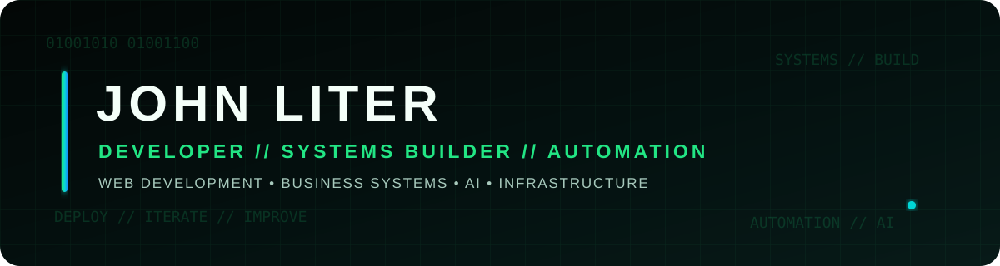

  

  
  
  
  

About Me
I build practical digital systems that solve real problems.
My work spans web development, business automation, CRM development, API integrations, AI-assisted workflows, analytics, and digital infrastructure. I focus on taking ideas from concept to production and learning through systems that are actually used.
I’m also completing my Bachelor’s Degree in Web Development at Baker College, where I continue strengthening the foundations behind the systems I build.
> I’m continuously developing my skills to reach the proficiency and understanding of veteran developers in this community.

  

Tech Stack

  
  
  
  
  
  

  
  
  
  
  
  

  
  
  
  

  

What I Build
<table>
  <tr>
    <td width="50%" valign="top">
      <h3>JL Enterprise CRM</h3>
      
Custom PHP/MySQL business platform for leads, customers, projects, scheduling, quotes, invoices, payments, analytics, communications, files, and automation.

    </td>
    <td width="50%" valign="top">
      <h3>Web Publisher</h3>
      
Browser-based publishing and document editor focused on page layout, movable objects, persistent document state, and migration away from legacy desktop publishing workflows.

    </td>
  </tr>
  <tr>
    <td width="50%" valign="top">
      <h3>RouteLedger</h3>
      
Mobile-first mileage tracking application designed around real gig-driving workflows instead of generic trip logging.

    </td>
    <td width="50%" valign="top">
      <h3>Creations</h3>
      
Creative platform combining AI-assisted imagery, original music, fictional worlds, artist personas, video concepts, and interactive web experiences.

    </td>
  </tr>
</table>

  

Development Focus
Full-stack web applications
CRM and internal business systems
Workflow automation with n8n
REST APIs, webhooks, and integrations
AI-assisted production workflows
Analytics dashboards
Responsive business websites
GitHub Actions and deployment pipelines
Client and lead management systems
Database-driven applications
How I Work
Build → Test → Break → Fix → Improve → Deploy
I use AI extensively as a development tool for research, debugging, architecture exploration, and problem solving. The responsibility for understanding and validating what gets deployed still belongs to the developer.

  

GitHub Activity

  
  

  

  

Find Me Online

  
  
  
  
  

  
  
  
  
  

  

